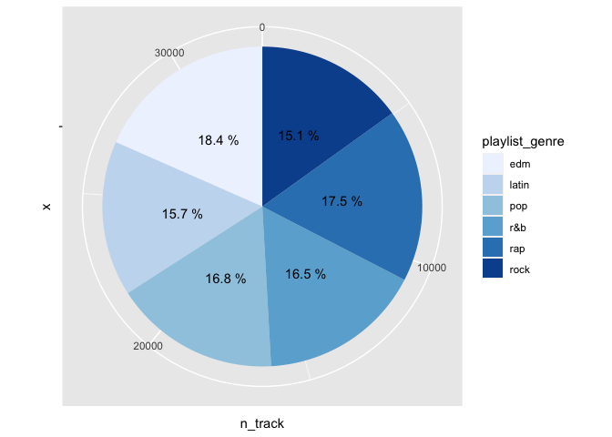
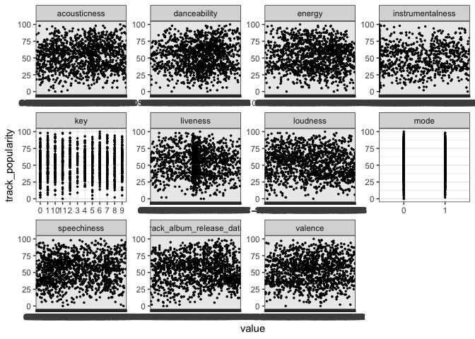

Spotify Data Analysis
================
Joon Kang and Mari Kang
2020-12-13

  - [Background Information](#background-information)
      - [Background](#background)
      - [Main Question](#main-question)
      - [Main Hypothesis](#main-hypothesis)
  - [Set Up](#set-up)
  - [EDA](#eda)
      - [Artists With Highest Number of Apperance in Top
        100](#artists-with-highest-number-of-apperance-in-top-100)
      - [Correlation Plot Between Multiple
        Factors](#correlation-plot-between-multiple-factors)
      - [Pie Chart and Box Plot of the
        Genre](#pie-chart-and-box-plot-of-the-genre)
      - [Correlation Including
        Popularity](#correlation-including-popularity)
  - [Deeper Analysis of the Genre](#deeper-analysis-of-the-genre)
      - [Key Features that Determine the
        Genre](#key-features-that-determine-the-genre)
      - [Popularity vs Determinant of the
        Genre](#popularity-vs-determinant-of-the-genre)
  - [Conclusion](#conclusion)

# Background Information

## Background

[Spotify](https://www.spotify.com) is one of the most popular music
streaming service in the world. There are more than 320 million users
using this service currently. In this project, we would be using the
subset of Spotify tracks’ metadata from `spotifyr` package to find out
what makes the song popular throughout the world. There are many factors
that can explain a song including genre, danceability, tempo, key, or
energy that can account for the popularity of the song. We will going to
investigate the popularity and other factors and find the factors that
makes a song popular worldwide.

## Main Question

What makes a song popular?

## Main Hypothesis

The more a song is true to genre, the more popular the song is.

# Set Up

``` r
library(tidyverse)
```

    ## ── Attaching packages ────────────────────────────────────────────────────────────────────────────────────────────────── tidyverse 1.3.0 ──

    ## ✓ ggplot2 3.3.2     ✓ purrr   0.3.4
    ## ✓ tibble  3.0.3     ✓ dplyr   1.0.2
    ## ✓ tidyr   1.1.2     ✓ stringr 1.4.0
    ## ✓ readr   1.3.1     ✓ forcats 0.5.0

    ## ── Conflicts ───────────────────────────────────────────────────────────────────────────────────────────────────── tidyverse_conflicts() ──
    ## x dplyr::filter() masks stats::filter()
    ## x dplyr::lag()    masks stats::lag()

``` r
library(ggrepel)
library(GGally)
```

    ## Registered S3 method overwritten by 'GGally':
    ##   method from   
    ##   +.gg   ggplot2

``` r
library(corrplot)
```

    ## corrplot 0.84 loaded

``` r
library(rpart)
library(rpart.plot)
library(fmsb)
```

``` r
df_spotify_songs <- readr::read_csv('spotify_songs.csv')
```

    ## Parsed with column specification:
    ## cols(
    ##   .default = col_double(),
    ##   track_id = col_character(),
    ##   track_name = col_character(),
    ##   track_artist = col_character(),
    ##   track_album_id = col_character(),
    ##   track_album_name = col_character(),
    ##   track_album_release_date = col_character(),
    ##   playlist_name = col_character(),
    ##   playlist_id = col_character(),
    ##   playlist_genre = col_character(),
    ##   playlist_subgenre = col_character()
    ## )

    ## See spec(...) for full column specifications.

``` r
df_spotify_songs <- df_spotify_songs %>% 
                filter(!is.na(track_name) & !is.na(track_artist) & !is.na(track_album_name))
```

# EDA

``` r
df_spotify_songs %>% 
  summary()
```

    ##    track_id          track_name        track_artist       track_popularity
    ##  Length:32828       Length:32828       Length:32828       Min.   :  0.00  
    ##  Class :character   Class :character   Class :character   1st Qu.: 24.00  
    ##  Mode  :character   Mode  :character   Mode  :character   Median : 45.00  
    ##                                                           Mean   : 42.48  
    ##                                                           3rd Qu.: 62.00  
    ##                                                           Max.   :100.00  
    ##  track_album_id     track_album_name   track_album_release_date
    ##  Length:32828       Length:32828       Length:32828            
    ##  Class :character   Class :character   Class :character        
    ##  Mode  :character   Mode  :character   Mode  :character        
    ##                                                                
    ##                                                                
    ##                                                                
    ##  playlist_name      playlist_id        playlist_genre     playlist_subgenre 
    ##  Length:32828       Length:32828       Length:32828       Length:32828      
    ##  Class :character   Class :character   Class :character   Class :character  
    ##  Mode  :character   Mode  :character   Mode  :character   Mode  :character  
    ##                                                                             
    ##                                                                             
    ##                                                                             
    ##   danceability        energy              key            loudness      
    ##  Min.   :0.0000   Min.   :0.000175   Min.   : 0.000   Min.   :-46.448  
    ##  1st Qu.:0.5630   1st Qu.:0.581000   1st Qu.: 2.000   1st Qu.: -8.171  
    ##  Median :0.6720   Median :0.721000   Median : 6.000   Median : -6.166  
    ##  Mean   :0.6549   Mean   :0.698603   Mean   : 5.374   Mean   : -6.720  
    ##  3rd Qu.:0.7610   3rd Qu.:0.840000   3rd Qu.: 9.000   3rd Qu.: -4.645  
    ##  Max.   :0.9830   Max.   :1.000000   Max.   :11.000   Max.   :  1.275  
    ##       mode         speechiness      acousticness    instrumentalness   
    ##  Min.   :0.0000   Min.   :0.0000   Min.   :0.0000   Min.   :0.0000000  
    ##  1st Qu.:0.0000   1st Qu.:0.0410   1st Qu.:0.0151   1st Qu.:0.0000000  
    ##  Median :1.0000   Median :0.0625   Median :0.0804   Median :0.0000161  
    ##  Mean   :0.5657   Mean   :0.1071   Mean   :0.1754   Mean   :0.0847599  
    ##  3rd Qu.:1.0000   3rd Qu.:0.1320   3rd Qu.:0.2550   3rd Qu.:0.0048300  
    ##  Max.   :1.0000   Max.   :0.9180   Max.   :0.9940   Max.   :0.9940000  
    ##     liveness         valence           tempo         duration_ms    
    ##  Min.   :0.0000   Min.   :0.0000   Min.   :  0.00   Min.   :  4000  
    ##  1st Qu.:0.0927   1st Qu.:0.3310   1st Qu.: 99.96   1st Qu.:187804  
    ##  Median :0.1270   Median :0.5120   Median :121.98   Median :216000  
    ##  Mean   :0.1902   Mean   :0.5106   Mean   :120.88   Mean   :225797  
    ##  3rd Qu.:0.2480   3rd Qu.:0.6930   3rd Qu.:133.92   3rd Qu.:253581  
    ##  Max.   :0.9960   Max.   :0.9910   Max.   :239.44   Max.   :517810

| Variable                   | Description                                  |
| -------------------------- | -------------------------------------------- |
| `track_id`                 | Unique ID of the song                        |
| `track_name`               | Name of the song                             |
| `track_artist`             | Artist of the song                           |
| `track_popularity`         | Song Popularity (0-100)                      |
| `track_album_id`           | Unique ID of the album                       |
| `track_album_name`         | Album name of the song                       |
| `track_album_release_date` | Date when album was released                 |
| `playlist_name`            | Name of the playlist                         |
| `playlist_id`              | ID of the playlist                           |
| `playlist_genre`           | Genre of the playlist                        |
| `playlist_subgenre`        | Subgenre of the playlist                     |
| `danceability`             | How suitable a track is for dancing (0-1)    |
| `energy`                   | Measure of intensity and activity (0-1)      |
| `key`                      | Estimated overall key of the track           |
| `loudness`                 | overall loudness of a track in decibels (dB) |
| `mode`                     | Modality (major or minor)                    |
| `speechiness`              | Presence of spoken words (0-1)               |
| `acousticness`             | Whether the song is acoustic (0-1)           |
| `instrumentalness`         | Whether a song contains no vocals (0-1)      |
| `liveness`                 | Presence of an audience (0-1)                |
| `valence`                  | Musical Positiveness (0-1)                   |
| `tempo`                    | Estimated tempo of a track (BPM)             |
| `duration_ms`              | Duration of the song ()                      |

## Artists With Highest Number of Apperance in Top 100

First, we will going to find out the artists who appeared in the Top 100
chart the most to get an insight of the top artists in the world.

``` r
df_appearance<- 
  df_spotify_songs %>%
    group_by(track_artist)  %>%
    summarise(n_apperance = n()) %>%
    filter(n_apperance > 1) %>%
    arrange(desc(n_apperance))
```

    ## `summarise()` ungrouping output (override with `.groups` argument)

``` r
df_appearance$track_artist <- factor(df_appearance$track_artist, levels = df_appearance$track_artist[order(df_appearance$n_apperance)])

df_appearance %>%
  head(10) %>%
  ggplot(aes(x = track_artist, y = n_apperance)) +
    geom_bar(stat = "identity",  fill = "grey", width = 0.6 ) + 
    labs(title = "Top Artists with Highest Number of Appearance", x = "Artists", y = "Number of Apperance on the Top 100") +
    theme(plot.title = element_text(size=15,hjust=-.3,face = "bold"), axis.title = element_text(size=12)) +
    geom_text(aes(label=n_apperance), hjust = 2, size = 3, color = 'white') +
    coord_flip()
```

<!-- -->

**Observation**:

  - This graph represents the top 10 artists with most number of
    appearance on the Top 100. The top 10 artists are: Martin Garrix,
    Queen, The Chainsmokers, David Guetta, Don Omar, Drake, Dimitri
    Vegas & Like Mike, Calvin Harris, Hardwell, and Kygo. Martin Garrix
    appeared on the Top 100 list for 161 times and is the artist with
    the highest number of appearance on the Top 100. Kygo appeared on
    the Top 100 list for 83 times and is the artist with the lowest
    number of appearnce on the Top 100 among the Top 10 artists.

## Correlation Plot Between Multiple Factors

Next, we will find out the general correlation between multiple factors
in the data set that might affect each other. We chose, danceability,
energy, key, loudness, mode, speechiness, acousticness,
instrumentalness, liveness, valence, tempo, and duration of the song for
the factors.

``` r
correlation_data <- df_spotify_songs[,-(1:11)]
correlated <- cor(correlation_data)
corrplot(correlated, method = "square", type = "lower",title = "Correlation Values", tl.srt = 45, tl.col = 'black')
```

<!-- -->

**Observation**:

  - This chart represents the correlation between the multiple factors
    that lie in the dataset. A bluer color represents a higher
    correlation, and the red represents a lower correlation. The opacity
    of the square represents the amount of correlation - In the chart,
    there is a very prominent correlation between the factors of energy
    and loudness, which means that if one of them is high, the other
    will be as well. On the other hand, energy has a strong negative
    correlation with acousticness. There are other correlations with
    valence and danceability, although not very strong. The other
    correlation values represented are trivial.

## Pie Chart and Box Plot of the Genre

Now, we will see if there’s any genre of the song that is preferred for
people. If certain genre appears in the dataset of Top 100 chart more
than other genre, it means that the genre is more loved compared to
other genre.

``` r
genre <- df_spotify_songs %>% 
  group_by(playlist_genre) %>% 
  summarise(n_track = length(playlist_genre))
```

    ## `summarise()` ungrouping output (override with `.groups` argument)

``` r
ggplot(genre, aes(x="", y=n_track, fill=playlist_genre)) + 
  geom_bar(width = 1, stat = "identity") + 
  coord_polar("y", start=0) + 
  scale_fill_brewer(palette="Blues") +
  geom_text(aes(label = paste(round(n_track / sum(n_track) * 100, 1), "%")),
            position = position_stack(vjust = 0.5))
```

<!-- -->

**Observation**:

  - This is the genre division between the songs stored in the dataset.
    There are different colors for different genres, and it looks like
    the division of the songs stored on the dataset is evenly balanced.
    This could mean a higher accuracy when comparing genre data, as
    there is little difference in population of the songs in each genre.
    The total number of songs is, as the glimpse has told us, around
    33000 songs.

To know more about the genre, we will choose the songs with top 100000
popularity and see the IQR and the outlier using the box plot.

``` r
pop <-
df_spotify_songs %>%
  arrange(desc(track_popularity))

pop = pop[!duplicated(pop$track_id),]

pop %>%
  head(10000) %>%
  group_by(playlist_genre) %>%
  ggplot(aes(x = playlist_genre, y = track_popularity)) + 
    geom_boxplot() 
```

<!-- -->

**Observation**:

  - This graph shows the boxplot between the genre and the popularity of
    the songs that are the 10000 songs that have highest popularity.
    Among the six genre, ‘pop’ has the highest median of the popularity,
    which is around 66 out of 100. One of the outlier of pop genre
    reaches 100 for the popularity, which means that the genre of the
    song with highest popularity is pop. ‘Edm’ genre has the lowest
    median and the range of the popularity among the genre of around 59
    out of 100. There’s no huge difference in the median among the
    genre, but we can see that it is more likely to have higher
    popularity for pop genre and lower popularity for edm genre.

## Correlation Including Popularity

In this part, we will going to include popularity in the correlation
plot from data of songs with top 100 popularity to see if there’s any
correlation betweeen other factors and the popularity of the song.

``` r
df_new <- df_spotify_songs %>%
  select(track_id, track_name,track_artist,track_popularity,danceability,energy,key,loudness,mode,speechiness,acousticness,instrumentalness,liveness,valence,tempo,duration_ms)
top100 <- unique(df_new[order(-df_new$track_popularity),],incomparables = FALSE)%>%
  head(100)
  
top100
```

    ## # A tibble: 100 x 16
    ##    track_id track_name track_artist track_popularity danceability energy   key
    ##    <chr>    <chr>      <chr>                   <dbl>        <dbl>  <dbl> <dbl>
    ##  1 2XU0oxn… Dance Mon… Tones and I               100        0.824  0.588     6
    ##  2 696Dnlk… ROXANNE    Arizona Zer…               99        0.621  0.601     6
    ##  3 7k4t7uL… Tusa       KAROL G                    98        0.803  0.715     2
    ##  4 2b8fOow… Memories   Maroon 5                   98        0.764  0.32     11
    ##  5 0sf12qN… Blinding … The Weeknd                 98        0.513  0.796     1
    ##  6 21jGcNK… Circles    Post Malone                98        0.695  0.762     0
    ##  7 0nbXyq5… The Box    Roddy Ricch                98        0.896  0.586    10
    ##  8 3ZCTVFB… everythin… Billie Eili…               97        0.704  0.225     6
    ##  9 6WrI0LA… Don't Sta… Dua Lipa                   97        0.794  0.793    11
    ## 10 4TnjEaW… Falling    Trevor Dani…               97        0.784  0.43     10
    ## # … with 90 more rows, and 9 more variables: loudness <dbl>, mode <dbl>,
    ## #   speechiness <dbl>, acousticness <dbl>, instrumentalness <dbl>,
    ## #   liveness <dbl>, valence <dbl>, tempo <dbl>, duration_ms <dbl>

``` r
t100correlation_data <- top100[,-(1:3)]
t100correlation_data
```

    ## # A tibble: 100 x 13
    ##    track_popularity danceability energy   key loudness  mode speechiness
    ##               <dbl>        <dbl>  <dbl> <dbl>    <dbl> <dbl>       <dbl>
    ##  1              100        0.824  0.588     6    -6.4      0      0.0924
    ##  2               99        0.621  0.601     6    -5.62     0      0.148 
    ##  3               98        0.803  0.715     2    -3.28     1      0.298 
    ##  4               98        0.764  0.32     11    -7.21     1      0.0546
    ##  5               98        0.513  0.796     1    -4.08     1      0.0629
    ##  6               98        0.695  0.762     0    -3.50     1      0.0395
    ##  7               98        0.896  0.586    10    -6.69     0      0.0559
    ##  8               97        0.704  0.225     6   -14.5      0      0.0994
    ##  9               97        0.794  0.793    11    -4.52     0      0.0842
    ## 10               97        0.784  0.43     10    -8.76     0      0.0364
    ## # … with 90 more rows, and 6 more variables: acousticness <dbl>,
    ## #   instrumentalness <dbl>, liveness <dbl>, valence <dbl>, tempo <dbl>,
    ## #   duration_ms <dbl>

``` r
correlated <- cor(t100correlation_data)
corrplot(correlated, method = "square", type = "lower",title = "Top 100 Correlation Values For 2020", tl.srt = 30, tl.col ='black')
```

<!-- -->

**Observation**:

  - This correlation plot includes one more variable in its factors,
    which is track popularity. This would let us track the popularity of
    the song along with the other factors, which then would allow us to
    estimate how much effect a factor has on making a song popular. In
    the plot, the correlation values are very insignificant with
    popularity. The only correlation that is non-trivial is duration,
    where it shows that there exists a positive correlation between song
    length and popularity, but not by much, The other factors such as
    danceability and energy also does not have a big effect on making a
    song popular, highly likely because the vast variety of songs and
    tastes of people around the world varies at an extent that would
    disperse the data, making a non or very low correlated factor.

# Deeper Analysis of the Genre

Our primary hypothesis of this project is that ‘The more a song is true
to genre, the more popular the song is.’ To check if our hypothesis is
correct, we will going to make deeper analysis of the genre for the rest
of the report.

## Key Features that Determine the Genre

To begin with, we will make a radar plot that shows what factors are
prominent in each genre. In other words, by knowing the factors that are
high in each genre, we can find out the main features of the genre.
Then, using these factors, we can see how true a song is to the genre by
looking at the factors.

``` r
genre_radar <- function(arg){
df_spotify_songs_filt <- df_spotify_songs %>% filter(playlist_genre==arg)
radar_data_v1 <- df_spotify_songs_filt %>%
  select(danceability,energy,key,loudness,mode,speechiness,acousticness,instrumentalness,liveness,valence)
radar_data_v2 <- apply(radar_data_v1,2,function(x){(x-min(x)) / diff(range(x))})
radar_data_v3 <- apply(radar_data_v2,2,mean)
radar_data_v4 <- rbind(rep(1,6) , rep(0,6) , radar_data_v3)
return(radarchart(as.data.frame(radar_data_v4),title=arg, cglcol='black', pcol = rgb(0.2,0.5,0.5,0.9), pfcol=rgb(0.2,0.5,0.5,0.5)))
}

par(mfrow = c(2, 3))
radar_latin<-genre_radar("latin")
```

    ## Warning in rbind(rep(1, 6), rep(0, 6), radar_data_v3): number of columns of
    ## result is not a multiple of vector length (arg 1)

``` r
radar_pop<-genre_radar("pop")
```

    ## Warning in rbind(rep(1, 6), rep(0, 6), radar_data_v3): number of columns of
    ## result is not a multiple of vector length (arg 1)

``` r
radar_rnb<-genre_radar("r&b")
```

    ## Warning in rbind(rep(1, 6), rep(0, 6), radar_data_v3): number of columns of
    ## result is not a multiple of vector length (arg 1)

``` r
radar_edm<-genre_radar("edm")
```

    ## Warning in rbind(rep(1, 6), rep(0, 6), radar_data_v3): number of columns of
    ## result is not a multiple of vector length (arg 1)

``` r
radar_rock<-genre_radar("rock")
```

    ## Warning in rbind(rep(1, 6), rep(0, 6), radar_data_v3): number of columns of
    ## result is not a multiple of vector length (arg 1)

``` r
radar_rap<-genre_radar("rap")
```

    ## Warning in rbind(rep(1, 6), rep(0, 6), radar_data_v3): number of columns of
    ## result is not a multiple of vector length (arg 1)

<!-- -->

**Observation**:

  - To go deeper into the hypothesis of how the key features of a song’s
    genre will be a determinant of what makes a song popular, we need to
    be able to plot what the main features of a genre is by taking the
    average quantity of what each genre has in terms of the multiple
    factors we have so far used. The radar chart above allows us to
    visualize what factors are prominent in each of the five genre. For
    instance, latin has a very high value in loudness, which means that
    loudness is a key factor in latin songs - almost all songs in latin
    has a high value of loudness within them. Because the radio chart
    can tell us these important factors, now we can use these to delve
    deeper into the correlation between the genre data and the prominent
    factor to see if our hypothesis is indeed correct.

## Popularity vs Determinant of the Genre

Since we know the key factors of each genre of the song, we will going
to plot the relationship between the popularity and the key factors for
each genre to see if our hypothesis is correct. For example, if loudness
is the most prominent factor that determines the Latin genre, we can say
that if a Latin song has higher loudness, the song is more true to the
genre. Then, if there’s a positive correlation between the loudness and
the popularity for Latin genre songs, we can conclude that Latin songs
tends to be more popular when it is more true to its genre.

``` r
pop <- df_spotify_songs%>% 
  filter(playlist_genre == 'pop') %>%
  select(track_album_release_date, track_popularity,danceability,energy,key,loudness,mode,speechiness,acousticness,instrumentalness,liveness,valence)


pop <- unique(pop[order(-pop$track_popularity),],incomparables = FALSE)%>% filter(str_detect(track_album_release_date,'2019'))


pop %>%
  gather(-track_popularity, key = "var", value = "value") %>% 
  ggplot(aes(x = value, y = track_popularity)) +
    geom_point(size = 0.5) +
    facet_wrap(~ var, scales = "free") + 
    theme_bw()
```

<!-- -->

``` r
pop %>%
  ggplot(aes(x = loudness, y = track_popularity))+
  geom_point()+
  geom_smooth(method="auto", se=TRUE, fullrange=FALSE, level=0.95)
```

    ## `geom_smooth()` using method = 'gam' and formula 'y ~ s(x, bs = "cs")'

<!-- -->

**Observation**:

  - With what the radio chart has provided us, we were able to identify
    that with the genre of ‘pop’, the most prominent factor out of the
    many is loudness. Then according to our hypothesis, the louder the
    song, the higher the popularity. Now we plot the facet wrap of each
    individual factors that are given with popularity. Here, we just
    need to look at the correlation with the plots - However, there
    seems to be no correlation between track popularity and any of the
    factors - rather, some of the facotrs just do not affect popularity
    in any way, such as key and mode. There seems to be a very slight
    correlation with loudness, but it is hard to tell this apart from
    the facet wrap.

  - The second graph that focuses on the loudness shows that the data is
    very dispersed - However there is a very slight correlation in the
    pop data where if the loudness increases in a pop song, there is a
    general increment in popularity. However the error margin of theis
    is very big, as there are popularity values from 0 to 100 within one
    loudness interval, which does not allow for any kind of prediction.
    It just represents that there is a possible trend of an increment of
    popularity when there is an increase in loudness.

<!-- end list -->

``` r
latin <- df_spotify_songs%>% 
  filter(playlist_genre == 'latin') %>%
  select(track_album_release_date, track_popularity,danceability,energy,key,loudness,mode,speechiness,acousticness,instrumentalness,liveness,valence)


latin <- unique(latin[order(-latin$track_popularity),],incomparables = FALSE)%>% filter(str_detect(track_album_release_date,'2019'))


latin %>%
  gather(-track_popularity, key = "var", value = "value") %>% 
  ggplot(aes(x = value, y = track_popularity)) +
    geom_point(size = 0.5) +
    facet_wrap(~ var, scales = "free") + 
    theme_bw()
```

<!-- -->

``` r
latin %>%
  ggplot(aes(x = loudness, y = track_popularity))+
  geom_point()+
  geom_smooth(method="auto", se=TRUE, fullrange=FALSE, level=0.95)
```

    ## `geom_smooth()` using method = 'gam' and formula 'y ~ s(x, bs = "cs")'

<!-- -->

**Observation**:

  - Moving on to the latin genre, the plots are the same as the one from
    pop. There seems to be no correlation in any of the factors, but a
    slight upward slope in loudness. Of course, this is a focus on most
    of the points, so we need a proper analysis of some of the plots.
    With loudness being a prominent factor in latin, we look at the
    specifics of the plot between popularity and loudness. In general,
    there is an upwards slope. Like the last test, the error bound is
    very large on this plot as well, values ranging from 0 and 100 in
    one interval of loudness. However, there is a trend existent.

<!-- end list -->

``` r
edm <- df_spotify_songs%>% 
  filter(playlist_genre == 'edm') %>%
  select(track_album_release_date, track_popularity,danceability,energy,key,loudness,mode,speechiness,acousticness,instrumentalness,liveness,valence)


edm <- unique(edm[order(-edm$track_popularity),],incomparables = FALSE)%>% filter(str_detect(track_album_release_date,'2019'))


edm %>%
  gather(-track_popularity, key = "var", value = "value") %>% 
  ggplot(aes(x = value, y = track_popularity)) +
    geom_point(size = 0.5) +
    facet_wrap(~ var, scales = "free") + 
    theme_bw()
```

<!-- -->

``` r
edm %>%
  ggplot(aes(x = energy, y = track_popularity))+
  geom_point()+
  geom_smooth(method="auto", se=TRUE, fullrange=FALSE, level=0.95)
```

    ## `geom_smooth()` using method = 'gam' and formula 'y ~ s(x, bs = "cs")'

<!-- -->

**Observation**:

  - Unlike the other 4 plots, edm has a negative correlation with its
    most prominent factor. Energy, which tends to be what most people
    think about when thinking about edm, is determined to be a prominent
    factor with the radio chart. However when plotted for a more
    specific lok, it turns out there is a negative trend between the
    popularity of a song in the genre of edm as the energy increases.
    There is no significant correlation in the other factors seen from
    the facets.

<!-- end list -->

``` r
rock <- df_spotify_songs%>% 
  filter(playlist_genre == 'rock') %>%
  select(track_album_release_date, track_popularity,danceability,energy,key,loudness,mode,speechiness,acousticness,instrumentalness,liveness,valence)


rock <- unique(rock[order(-rock$track_popularity),],incomparables = FALSE)%>% filter(str_detect(track_album_release_date,'2019'))


rock %>%
  gather(-track_popularity, key = "var", value = "value") %>% 
  ggplot(aes(x = value, y = track_popularity)) +
    geom_point(size = 0.5) +
    facet_wrap(~ var, scales = "free") + 
    theme_bw()
```

<!-- -->

``` r
rock %>%
  ggplot(aes(x = loudness, y = track_popularity))+
  geom_point()+
  geom_smooth(method="auto", se=TRUE, fullrange=FALSE, level=0.95)
```

    ## `geom_smooth()` using method = 'loess' and formula 'y ~ x'

<!-- -->

**Observation**:

  - Rock has its most prominent factor set as loudness. Which makes
    sense because rock songs are very loud, and it is hard to find a
    rock song with low energy and volume. THe correlation, according to
    logic seems fair - but it turns out that the correlation is
    seemingly negative. However we noticed that without the 3 outliers
    that exist in the start of the plot, the line of best fit would
    curve to the positive direction. In general, this is the highest
    correlative factor compared to the others, shown in the facet.

<!-- end list -->

``` r
randb <- df_spotify_songs%>% 
  filter(playlist_genre == 'r&b') %>%
  select(track_album_release_date, track_popularity,danceability,energy,key,loudness,mode,speechiness,acousticness,instrumentalness,liveness,valence)


randb <- unique(randb[order(-randb$track_popularity),],incomparables = FALSE)%>% filter(str_detect(track_album_release_date,'2019'))


randb %>%
  gather(-track_popularity, key = "var", value = "value") %>% 
  ggplot(aes(x = value, y = track_popularity)) +
    geom_point(size = 0.5) +
    facet_wrap(~ var, scales = "free") + 
    theme_bw()
```

<!-- -->

``` r
randb %>%
  ggplot(aes(x = loudness, y = track_popularity))+
  geom_point()+
  geom_smooth(method="auto", se=TRUE, fullrange=FALSE, level=0.95)
```

    ## `geom_smooth()` using method = 'gam' and formula 'y ~ s(x, bs = "cs")'

<!-- -->

**Observation**:

  - R\&B is known for its smoothness and words that stay true to the
    heart. Logically, wordiness and acousticness would have a high rank
    with R\&B but surprisingly, loudness was once again the most
    prominent value to look for when comparing it to popularity of the
    song. With the specific plot, There is a positive trend that is
    virtually non-existent because of the spread of the data. There is a
    larger spread in this genre than any other genres, making the
    correlation virtually unusable for reference. The facets also show
    that there are no other prominent correlations worth noting.

# Conclusion

Our Question for this project was "What makes a song popular?’ Of
course, this is a very wide question that could be answered in many
different ways. Our hypothesis that we set up for this question was that
because a genre of a song contains some kind of prominent factor that we
can quantify, there would be correlation between the prominent factor of
the genre and the popularity of the song. With was tested by taking the
basic correlations between the factors to see if they have any relations
to each other, then we moved on to check for possible errors when doing
calculations on the dataset by making a pie chart and looking at the
distributions of genres in the dataset. Then we checked for correlations
in the top 100 songs to have a more specific view at the correlation
between popularity and the factors, which returned nothing non-trivial.
With the information we had, we moved onto taking the most prominent
factors within the genres. This was then taken with the filtered data of
each genres of 2019 (which has a complete set of songs unlike 2020 with
insufficient data). The data was plotted with the popularity, firth with
facets and other factors to find any correlations that our hypothesis
possibly could have missed. After realizing that none of our genres have
a prominent factor that shows correlation, we moved onto specifics which
allowed us to distinguish the trend that appeared with popularity and
the prominent values. It turns out there are 3 positive, 1 inconclusive
and 1 negative trends - this makes the test inconclusive, not to mention
the fact that these positive and negative trends are with very large
error margins due to the spread of data. We can therefore conclude that
our hypothesis is wrong in the view of a prominent factor of a genre
being a determinant of popularity, but reasonably correct in terms of
viewing the factor with a general trend, unlike the others that almost
looked unrelated to popularity looking at the facets.
